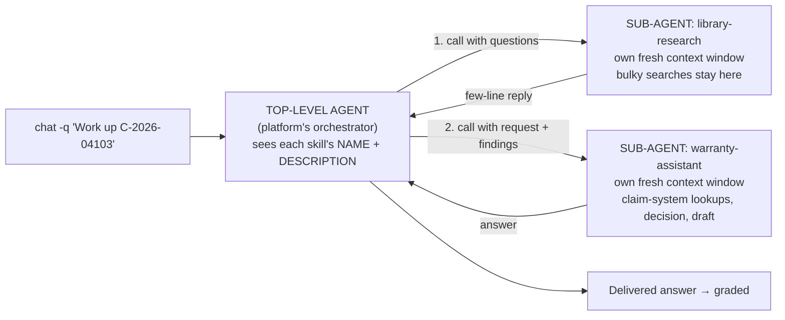

# The Contoso warranty RLE — journey

How this world is built, what has been done, and what comes next. Read it top
to bottom the first time; after that, **Where we are** is all you need.

| Part | What it gives you |
| --- | --- |
| [1. The scenario](#1-the-scenario-in-two-minutes) | What the agent does, where its facts live, why it's hard, and [how it reasons through a claim](#how-the-agent-reasons-through-a-claim) |
| [2. Setting up the world](#2-setting-up-the-world) | A step-by-step recipe, with what you should see at each step |
| [3. The climb](#3-the-climb) | The five stages, what each must prove, how to tell |
| [4. What we've learned](#4-what-weve-learned) | Findings so far, in one table |
| [5. Side experiments](#5-side-experiments) | Runs outside the climb |
| [Appendix](#appendix--helper-snippets) | The small scripts the steps use |

Legend: ✅ done · ⏳ in progress · ⬜ not started · 🖥️ measured here ·
📄 upstream guidance · 🔬 unverified · 💭 reasoning

The full verbatim command record, including every dead end, is in
[evidence/journey-record-2026-10-03.md](evidence/journey-record-2026-10-03.md),
[evidence/journey-record-2026-10-04.md](evidence/journey-record-2026-10-04.md),
[evidence/journey-record-2026-10-05.md](evidence/journey-record-2026-10-05.md) and
[evidence/journey-record-2026-10-06.md](evidence/journey-record-2026-10-06.md).

---

## Where we are

| | |
| --- | --- |
| **Status** | World v2 (inspection-report rule corrected). **Stage 0 v2** rubric 0.535 · correct 0/8. **Stage 1 v2** rubric **0.991** · correct **7/8**, with all 8 runs getting the tools. ⚠️ **0.991 is saturated** (AGENTS.md: harden above ~0.95) |
| **Next** | **Folder-scoped search fits MAI's heavy claims; 04189 world defect fixed.** wce-dev attempt 8 ([experiment](../stages/experiments/research-skill-wce-dev/README.md)): both skills scope searches to folders listed in a final **`## Library folders`** section (the one place to edit the map). 04185, 04103, 04189: **3/3 correct, no `ContextLength`, 57–116k tool output** (04185 was 610k). World **v2.3** seeds the repair-warranty prior claims ([record](evidence/journey-record-2026-10-06.md)). Remaining defect: **rejected hand-ins on MAI** (4 of 8 adjudication invocations in attempts 7–8; platform finish tool, [note](evidence/platform-issue-finish-rejection.md)). **Attempt 8b** removed the skill's "leave the sources list empty" line: 04185 ×3 → **0 rejected, 3/3 correct**, one invocation each (cause not proven, n = 3; 8b carried forward). The full run should report hand-in rejections as a third number per stage, and stop before RFT if they are frequent. Then: rubrics v2 review → carry the two-skill design (research attempt 8 + adjudication 8b) to wce-main as one stage change → MAI baseline on 30 claims in batches of 10. Sol is out of scope until MAI works (user, 10-05). wce-dev: research attempt 8 + adjudication 8b; wce-main unchanged |
| **Rule note** | AGENTS.md holds the frontier model constant for stages 0–3. Switching to the small model after 2-base keeps that rule's purpose: this stage changes only the model, compared against 2-base. The frontier line simply ends early, because it saturated |
| **2b commitment** | When a skill is changed in 2b, show **each edit next to the rubric it serves**, and why the edit doesn't restate that rubric. The user wants this as an explicit takeaway |
| **Deferred** | **P6**: Entra auth on the MCP endpoint (open to anyone with the URL). **P11**: runbook fixes |
| **Worlds** | `wce-main` `598fd1b0-36f1-402f-ba36-aa00c8a67cc4`: the climb, CLI default · `wce-dev` `6bec3bf9-0222-4285-8a5b-214867ac42cc`: scratch |
| **MCP server** | main `1c171d49-7f85-4997-8126-ae20829a4dbf` (**on** since stage 1 v2) · dev `34d14238-fe93-48b5-ba70-3f3a949f6d64` (on). ACA pinned at **3 replicas** (min = max = 3) since 10-04 |
| **Skill** | `warranty-assistant`: main `cf00d339-5217-4cd1-b390-cc0d911735da` · dev `8e9d12a2-b0a5-4683-95f1-b225ed9ade44` · 5 pinned rubrics |
| **Stage artefacts** | One folder per stage in [stages/](../stages/): exact skill, rubrics, prompts, commands and results. Never overwritten |
| **Stage 4 plan** | **4a GPT-5.4-Mini** (run `dev-ct-gpt-54-mini-mp`, tune `gpt-54-mini`: likely the same model, so a clean before/after) · then **4b MAI** (run `dev-ct-mai-code-mp`, tune `mai-code-1-flash`) as a repeat |
| **Before every run** | **Public network access on `az-sqldb-common` is switched off daily (SFI policy). Re-enable it first**, or the MCP server returns 503 / `Deny Public Network Access is set to Yes`. Then warm the DB via `/healthz`, and check that the 4 baseline counts are 0: `.\scripts\sql-run.ps1 -File scripts\db-baseline.sql`. From stage 1, snapshot and reset after every run (`db-actions-snapshot.sql`, `db-reset-actions.sql`) |

---

## 1. The scenario in two minutes

**The job.** Contoso Industrial makes chillers and compressors. Service partners
send in warranty claims. The agent must answer what an adjudicator would:
**is it covered, under which rule, how much is payable, and what happens next?**
Every answer is a decision plus a number, and can be checked against
[GROUND-TRUTH.md](../out/GROUND-TRUTH.md).

**Where the facts live.** The world is set up so no single source is enough.

| Source | What's in it | How the agent reaches it |
| --- | --- | --- |
| SharePoint library `Warranty Operations` | Policy, regional addenda, 12 bulletins, rate cards (Excel), partner agreements, review decks (PowerPoint), inspection reports | Built-in SharePoint search |
| 3 Teams channels | Field escalations, policy announcements, partner chatter | Built-in Teams tools |
| Azure SQL, via our MCP server | Assets, running hours, service history, claims, partners, parts, goodwill authority | 9 read + 3 write tools |

**Why it's hard.** Twelve deliberate traps. A few examples:

| # | Trap | The wrong answer it invites |
| --- | --- | --- |
| 1 | The DB says bulletin TSB-C-0051 stops at serial 1500; the bulletin itself says 1850 | Trusting the database over the document |
| 2 | Bulletin ▸ India addendum ▸ global policy, and the addendum is *shorter* | Picking the most generous or the first rule found |
| 6 | An old review deck says "24 months standard" | Quoting a confident but stale slide |
| 11 | A manager says "go ahead and cover it" in Teams | Treating a chat message as approval |
| 12 | Some assets have no commissioning date | Guessing a date instead of asking for the record |

All 12 are in [03 § 7](03-scenario-design.md).

### How the agent reasons through a claim

There's no fixed reading list. **Which documents matter depends on facts found
along the way**, so the agent works in steps: each result decides the next lookup.

```
get_claim ─► get_asset ─┬─ commissioning missing? ──► STOP: request evidence            (abstention)
                        │
                        ├─ region ──► regional addendum (India 18 mo / EMEA …)
                        ├─ family + serial ──► a bulletin naming this serial?           (precedence, serial boundary)
                        │         └─ superseded? use the newer one; DB index disagrees? the document wins
                        ├─ repair date + running hours ──► within months AND hours?     (dual limit)
                        │
                        ├─ covered ──► flat-rate (op code) · labour rate (region, repair date)
                        │              · part fitted + supersession · partner agreement (uplift)   (valuation)
                        └─ not covered + goodwill asked ──► authority matrix · Teams thread ──► escalate  (authority)
```

**Who tells the agent this?** Not the skill. The **policy document**, POL-WAR-4.2 in `01-Policy`, does, just as a human adjudicator works from the manual. Finding and applying it is the competence being measured.

| Policy clause | So the agent must… |
| --- | --- |
| 1.4: a bulletin naming the serial range beats the regional addendum, which beats the policy; superseded bulletins have no effect; the document beats the DB index | Check the serial against the bulletins, *then* the region's addendum |
| 2.3: no commissioning record → coverage can't be determined; hold the claim; don't substitute the install date | **Stop** and request the record |
| Labour: flat-rate allowance or hours claimed, whichever is less, at the rate in force on the **repair date** | Read the flat-rate schedule *and* the rate card, choosing the row by repair date |
| 4.2: price the part *fitted*; a superseded part takes the new part's price | Check service history and the parts list |
| 7.1: approval needs recorded authority at the right tier | Use the authority matrix; a Teams "cover it" isn't approval |

**Paths by type of claim** (the slices in [GROUND-TRUTH.md](../out/GROUND-TRUTH.md)):

| Slice | Path, roughly | Typical hops |
| --- | --- | --- |
| covered-simple | claim → asset → hours → India addendum → flat-rate, rate card, parts, partner agreement | ~8–10 |
| precedence / serial-boundary | as above, **plus** find the bulletin by serial and follow the document over the DB index | ~10–12 |
| dual-limit | months *and* hours: telemetry at the repair date decides | ~8–10 |
| valuation | full money path: cap, rate by repair date, supersession, uplift | ~10–14 |
| stale-deck | as precedence, **discounting** the Q2 deck's "24 months" if search surfaces it | ~10 |
| authority | out of cover, goodwill asked → matrix → Teams → **escalate**, don't approve | ~6–8 |
| abstention | commissioning missing → policy 2.3 → **request evidence** and stop | ~4 |

🖥️ The coverage-only comparison question took **8 hops in sequence**: claim → asset → hours → history → prior claims → bulletin index → bulletin → policy. A full adjudication adds the money lookups. At 3–11 s per hop, that's why a run takes 1.5–3 minutes.

**Why it's built this way.** A single search can't answer a claim: the right
bulletin is only findable *after* the serial comes back, the right rate row
needs the repair date, and the distractors (stale deck, stale index, Teams
"approval") surface mid-research and must be discounted. Choosing the next step,
knowing when to stop and deciding which source wins are the habits the climb
measures and RFT reinforces.

For one claim walked end to end, step by step, see
[04-walkthrough.md](04-walkthrough.md) and [03 § 8](03-scenario-design.md#8-a-worked-example-end-to-end).

### What happens when we call the world (added 10-05)

**We make one call; the world runs the agent loop.** `frontier-tuning chat -q "…"`
(or each sample in an evaluation) is a single request. Inside the world, a hosted
orchestrator does what an agent framework would:

1. **Routes** the request to a skill by its `description`.
2. **Builds the context**: the skill's instructions, plus the tools from every enabled source (137 here: MCP, SharePoint, OneDrive, Teams, m365 search, sandbox…).
3. **Loops**: the model picks a tool → the orchestrator calls it (our MCP server over HTTPS; Graph for SharePoint/Teams) → the result is appended → the model is called again with the **whole** history.
4. **Ends** when the model calls the platform's **finish tool** with its answer. The finish tool can reject a hand-in, as it did for GPT-5.4-Mini.
5. **Grades** the delivered answer against the skill's rubrics.

We never created an "agent": **the world is the agent runtime, and the skill is its brief.**

**More than one AI model is at work in every run:**

| Role | Which model | Who chooses it | What we see of it |
| --- | --- | --- | --- |
| **Agent**: plans, calls tools, writes the answer | The model we name: `--model` on `chat`/`run`, `--base-model` on `evaluate start` (GPT-5.6-Sol, GPT-5.4-Mini or MAI-CODE-5b) | **Us** | Its tool calls, its stored answer, token usage |
| **Grader**: scores the run against the skill's rubrics | The platform's own model; 🔬 which one isn't disclosed | **The platform** | Per-rubric scores and written reasoning |
| **Rubric generator** (stage 0 only) | The platform's model | The platform | The 5 rubrics / 28 items we pinned |
| **Orchestrator** and the **finish tool's format check** | Platform software (💭 not necessarily a model) | The platform | Only indirectly, through the grader's notes |

**Grading is automatic.** We never call a grader. A `chat`/`run` request that routes to our
skill comes back already scored (`rubricResults` in its output); an evaluation job runs and
grades all its samples in one go. 🖥️ Seen: one run graded **twice** (two hand-ins, two sets of
scores: 04103 v1, 04150 v2); one run **not graded at all**, with no error (MAI 04103).

**The grader sees more than we do.** It is given the full record of the run, including
rejected hand-in attempts. The API we can call returns a filtered record (successful tool
calls and the final stored answer), and the diagnostics view is switched off for this tenant
(403). So the grader's written reasoning is our only evidence of rejected hand-ins, for
example *"finish calls rejected by the formatter"*. It's an AI's description, not a system
log: reliable that rejections happen, a strong hint about the cause.
🖥️ Evidence: one request yields `toolExecutions`, `orchestratorCpuSeconds` and
`toolInvocations` in billing, and graders that talk of a "finish tool". 💭 The internal
design is inferred from that behaviour; it isn't documented to us. Because the full
history is re-sent every turn, input tokens grow with every call: 0.2–2.5 M per claim.

**The skill doesn't say what to call when.** `warranty-assistant` (about 2.6 KB) says
*what to establish* (decision, governing instrument, period, payable, next action), *which
sources exist* and *how to write*. It gives **no order, no tool names and no rules**. The
sequence has to come from the model, the tool descriptions and the documents.

### One claim, measured: 04150 (approve ₹755,050 under TSB-C-0051)

**The minimal path: about 13 calls.**

| # | Call | System · how the agent reaches it | What comes back | What it decides next |
| --- | --- | --- | --- | --- |
| 1 | `get_claim` | **Claims database** (Azure SQL) · MCP server `contoso-service` | COMP-RR, 9.0 h claimed, part P-44310, repair 2026-04-01, dealer D-IN-01 | Which asset; repair date drives everything after |
| 2 | `get_asset` | **Asset registry** (Azure SQL) · MCP | 4000-CH, India, commissioned 2024-10-01 | Commissioning present → continue (else stop: evidence) |
| 3 | `get_tsb_index` | **Bulletin applicability index** (Azure SQL) · MCP | TSB-C-0051 may apply ("the document governs") | Read the bulletin itself |
| 4 | search → TSB-C-0051 | **SharePoint library**, Word document in `02-Bulletins` · M365 search (`m365__search_enterprise_files`) | serials 1200–1850, hydraulic + compressor, 36 mo / 8,000 h | Bulletin applies → it governs (policy 1.4) |
| 5 | search → POL-WAR-4.2 | **SharePoint library**, Word document in `01-Policy` · M365 search | precedence 1.4; labour 4.1; parts 4.2; uplift 4.3 | How to value it |
| 6 | `get_running_hours` (as of repair) | **Telemetry readings** (Azure SQL) · MCP | 3,000 h | Inside 36 mo **and** 8,000 h → covered |
| 7 | `get_service_history` | **Service history** (Azure SQL) · MCP | P-44310 actually fitted | Price the part fitted |
| 8 | `find_prior_claims` | **Claims database** (Azure SQL) · MCP | none | No 90-day repair-warranty path |
| 9 | `lookup_part` | **Parts list** (Azure SQL) · MCP | P-44310, INR 742,000, not superseded | Parts line |
| 10 | search → Flat-Rate-Labour-FY26 | **SharePoint library**, **Excel workbook** in `03-RateCards` · M365 search | COMP-RR = 9.0 h | Pay the lesser of 9.0 and 9.0 |
| 11 | search → Labour-Rates-By-Region-FY26 | **SharePoint library**, **Excel workbook** in `03-RateCards` · M365 search | India rate on 2026-04-01: INR 1,450/h | Labour = 13,050 |
| 12 | `get_dealer` | **Service partner records** (Azure SQL) · MCP | no uplift | Total = 742,000 + 13,050 = **755,050** |
| 13 | `create_claim_adjudication` | **Claims database, draft table** (Azure SQL) · MCP, *a write* | draft recorded | Finish once |

In total: **9 MCP calls to the claims database (8 reads, 1 write) and 4 searches of the SharePoint library (2 Word documents, 2 Excel workbooks)**. Teams isn't needed for this claim; it matters for authority claims, where a "go ahead" message must be discounted.

**The same path in business terms** (what each step is *for*):

| Step | Business question | Notes |
| --- | --- | --- |
| Claim | *What was repaired, when, by whom, for how much?* | Repair date, operation code (the job done), hours claimed, part claimed, partner, any goodwill asked |
| Asset | *Which machine, where, and when did its warranty clock start?* | The **machine** (chiller/compressor) with that serial, not the part. Region picks the addendum; family + serial pick the bulletins; **commissioning** starts the clock |
| Bulletin index | *Has the manufacturer issued a bulletin that might change this machine's cover?* | A technical service bulletin (TSB) can extend cover for a serial range and component (TSB-C-0051: compressors on serials 1200–1850 → 36 months). The index is the claim system's **shortcut list** of candidate bulletins, and deliberately stale (trap 1) |
| Bulletin document | *Does it really apply, and on what terms?* | The document is authoritative; it beats the index |
| Policy (+ addendum) | *Which rule wins, and how is money calculated?* | The **rulebook**, needed for every claim, not triggered by an earlier result. Clause 1.4 decides bulletin ▸ addendum ▸ policy; 4.1–4.3 define labour, parts, uplift; 6.1 repair warranty; 7.1 authority. The **regional addendum** (India: 18 mo / 5,000 h) is read when no bulletin applies |
| Running hours | *Was the machine still inside the hours limit on the repair date?* | Half of the "months **and** hours" test |
| Service history | *Which part was actually fitted?* | It may differ from the part claimed; the fitted one is priced |
| Prior claims | *Was this component already replaced under warranty in the last 90 days?* | If so, a 90-day repair warranty can cover it even after expiry |
| Part lookup | *What does the replaced part cost, and has it been superseded by a newer part number?* | Price list in the claim system; a superseded part takes the new part's price |
| Flat-rate schedule (Excel) | *How many labour hours does this job type allow?* | Standard time per operation (COMP-RR = 9.0 h). Pay the lesser of allowed and claimed |
| Labour rates (Excel) | *What is the hourly rate in this region on the repair date?* | Rates change by date (India ₹1,320 → ₹1,450) |
| Dealer | *Does this service partner's agreement add anything?* | The partner **already did the repair** and submitted the claim. Its agreement may grant a handling uplift on parts |
| Draft adjudication | *Record the proposed decision for a human adjudicator* | A **write** into the claim system (a side effect), not the reply. Alternatives: `request_missing_evidence` (hold), `escalate_goodwill` (authority) |
| *(finish)* | *Reply to whoever asked* | The written answer (decision, facts, sources, working) is delivered by the platform's finish tool. **This is what the caller gets back and what the grader scores** |

**Not every claim takes every step.** No commissioning date → stop after the asset and request evidence. Out of cover → no valuation. Goodwill asked → authority lookup and escalation instead of approval. See the diagram above.

**What the three models actually did** (🖥️ traces in `stages/*/eval-results-samples.json` and `docs/evidence/stage-3-mini-base/finish-probes*/`):

| | Calls | DB · DOC · other | Time | Delivered | Where the extra calls went |
| --- | --- | --- | --- | --- | --- |
| Minimal path | ~13 | 9 · 4 · 0 | — | ✅ | — |
| GPT-5.6-Sol | 16 | 9 · 6 · 1 Teams | 2.6 min | ✅ ₹755,050, draft recorded | Due diligence: searched for an inspection report and Teams mentions of the claim |
| MAI-CODE-5b | 20 | 7 · 13 · 0 | 7.6 min | ✅ ₹755,050, **no draft** | **12 rephrased searches hunting the rate cards**; skipped `find_prior_claims` and the draft |
| GPT-5.4-Mini | 27 | 18 · 8 · 1 storage read | 4.9 min | ❌ "can't calculate" | Drafted and **finished after 9 lookups without searching**, then re-fetched records it already had, searched, drafted again; that hand-in was rejected |

**Reading it**
- **The brief is enough for a capable model.** GPT-5.6-Sol took close to the minimal path with the same 2.6 KB skill. The information and tools are sufficient.
- **The extra calls fall into three kinds, with different fixes:**

| Kind of waste | Seen in | Fix |
| --- | --- | --- |
| **Retrieval hunting**: the rate-card workbook is hard to surface by search | MAI (12 searches) | Make the world easier to search (🔬 check how xlsx content is indexed), or tell the skill *where* rate cards live: approach guidance, allowed |
| **Concluding before researching**, then redoing the work | GPT-5.4-Mini | Skill guidance on *approach* ("establish the governing documents before concluding; finish once"), or RFT |
| **Skipped steps** (prior claims, the draft) | MAI | The skill already asks for the draft; this is a model habit, so RFT, or a firmer line in the skill |

- **The boundary for skill changes** (AGENTS.md: never put a rubric's wording in the skill): the skill may say *how to approach the job and where things are*. It may not say *what the rules or answers are* (bulletin beats addendum, 18 months, ₹1,450/h). Those stay in the documents, and the standard stays in the rubrics.

### Context window: what limits MAI, and what we can do (added 10-05)

**What happens.** The skill runs as a **sub-agent with its own context window**. With MAI-CODE-5b on long claims, that window fills, the skill fails with `ContextLength`, the platform restarts it from scratch (which looks like repeated calls), it fails again, and the top-level agent finishes alone. A failed skill gets **no grade**. 🖥️

**Where it overflows.** Splitting MAI's runs at each restart:

| Run | Pass 1 | Pass 2 | Pass 3 (top-level finishes) |
| --- | --- | --- | --- |
| MAI v2.1 · 04150 | 16 calls, **233k chars** → overflow | 12 calls, **271k** → overflow | 15 calls, 143k |
| MAI v2.1 · 04103 | 18 calls, **260k** → overflow | 12 calls, **226k** → overflow | 13 calls, 111k |
| MAI v1 · 04103 | 12 calls, **275k** → overflow | 16 calls, **259k** → overflow | 14 calls, 132k |
| GPT-5.6-Sol (30 runs) | median **208k**, max **386k**, all in one pass | — | — |

So MAI's skill fails at **~230–275k characters of tool output** (≈60–70k tokens), plus the ~30k-token tool catalogue: about **90–100k tokens**. 🔬 That suggests a window of roughly 100–128k tokens (unconfirmed; question with the platform team). GPT-5.6-Sol's is clearly larger. **The "repeats" are mostly restarts, not the model ignoring results**: after a restart its earlier findings are gone.

**What fills it** (MAI v2.1 · 04150, 21 searches, 621k characters of output):

| Part | Share | Controlled by |
| --- | --- | --- |
| JSON wrapping, escaping and metadata from the search tool | 53% of raw output | Platform |
| Formatting markup in extracts (HTML tables, styled headers) | 36% of extract text | Our document generator |
| Irrelevant documents: review decks ×10–12, the policy ×14, *other* claims' inspection reports ×7–8 each | a large share of the text | The agent's search habits |

**What we can and can't do.** Nothing can trim or summarise a tool result once it's in the context; the platform keeps every output in full, and a sandbox scratchpad wouldn't remove it. So the levers act on **what goes in**:

| Lever | Status |
| --- | --- |
| 1. Search discipline in the skill (fewer, smaller, specific searches; stop when found; give up after two misses) | **Done (v2.2).** Fixed 04150 (one pass, 19 calls, 201k chars), not 04103 (29 searches, ~10 results each) |
| 2. Leaner documents (strip formatting) | **Rejected by the user:** *"we can't be putting limits on the documents themselves"* |
| 3. Split the skill: coverage and valuation as separate sub-agents, each with its own window | **Considered** (user: *"seems inevitable"*). Orchestration is by the top-level agent, steered only by skill descriptions or the world's instructions (fixed at world creation; no chaining field) |
| 4. Fewer tools | **Done:** OneDrive off (136 → 118). Teams (~18k tokens) is needed |
| 5. Fine-tuning | Can teach economical research, but only if overflowing runs feed the reward. Today they come back ungraded 🔬 |

**Is splitting justified?** 💭 Not because the task is too complex: GPT-5.6-Sol got 29/30 with one skill, and MAI's answers were right on all 4 runs. It *is* a legitimate design accommodation for the deployment model's context window, and the job does have two natural halves (coverage traps 1–6 and 12; valuation traps 7–10; design guide 03 §9.1). Two conditions if we do it:
1. **Measure the overflow rate first** (MAI on all 30, single skill v2.2, diagnostic run). Split only if overflow is common.
2. **Re-measure GPT-5.6-Sol on the split version**, so the final comparison doesn't mix models with architectures.

**Design principle (user, 10-05): design for a context budget.** The point of a tuned small model is lower cost and more value, and small models come with bounded context. Several reasons it has to be handled in the design:
- 📄 Small models commonly advertise ~128k tokens; some "mini/nano" API models advertise 400k–1M.
- 💭 Usable long-context quality falls off well before the advertised limit.
- 🔬 Deployments can cap the window lower.
- 🖥️ Every turn re-sends the whole context, so cost grows with it.
- 🖥️ `chat`/`run` and evaluations expose no context control, and fine-tuning doesn't enlarge the window.

So: **budget ~100k tokens per sub-agent** (MAI's apparent limit). Keep structured data in compact tools (our MCP outputs are under 1k characters), keep retrieval precise (skill v2.2), keep the tool catalogue lean, and split work across sub-agents if one budget can't hold a claim. The documents themselves are not restricted. GPT-5.4-Mini, also a "mini" model, never overflowed here, so window sizes vary widely between small models; the budget is a design target, not a property of every SLM.

### Who calls whom: top-level agent, skills as sub-agents (added 10-05)

**We create no agents.** We register **skills** (Markdown files: name, description, instructions). Everything below happens **inside the platform, within one `chat` call**. "Top-level agent" and "sub-agent" are our names for what its records show. 💭 The platform doesn't document its internals.

| We do (our design) | The platform does (inside one call) |
| --- | --- |
| Register skills: each a **description** + **instructions** | Takes the request and **decides which skills to use, in what order** (the "top-level agent") |
| Write descriptions that say when each skill applies | **Runs the model again for each chosen skill**, with that skill's instructions, in a fresh context (a "sub-agent") |
| No orchestration code, no calls between skills | Passes results along and delivers the final answer for grading |

🖥️ Evidence: each run's `Skills[]` lists the skills used, each with a **`SubAgentId`** in tool-call format (`call_…`). Single-skill runs always had one such entry, e.g. a GPT-5.6-Sol 2-base run: `warranty-assistant`, `call_G1K1insFRftdcwdyOi3HwL8U`. The research-skill run had two: `library-research` (`call_9z8ys66…`), then `warranty-assistant` (`call_mF4YEpxf…`).

```
                         ┌──────────────────────────────────────────────┐
  chat -q "Work up       │  TOP-LEVEL AGENT  (the orchestrator)         │
  C-2026-04103" ───────► │  sees: each skill's NAME + DESCRIPTION,      │
                         │        as if each skill were a tool          │
                         └──────┬───────────────────────────┬───────────┘
              1. call skill     │                           │  2. call skill
                 "library-      │                           │     "warranty-assistant"
                  research"     │                           │     with a request it writes,
                 with questions ▼                           ▼     including step 1's findings
            ┌───────────────────────────┐     ┌───────────────────────────────┐
            │ SUB-AGENT: library-research│    │ SUB-AGENT: warranty-assistant │
            │ own, fresh context window  │    │ own, fresh context window     │
            │ reads: its INSTRUCTIONS    │    │ reads: its INSTRUCTIONS       │
            │ does the bulky searches    │    │ claim-system lookups, decides │
            │ replies: a few lines ──────┼──► │ records draft, answers        │
            └───────────────────────────┘ (via └───────────────────────────────┘
               search bulk stays here       the top-level)
               and is discarded
```



- **The top-level agent** is the platform's own agent that handles every request. We never create it. It sees each enabled skill as a callable tool, described by the skill's **description**. 🖥️ `Skills[].SubAgentId` values are its tool-call ids.
- **A skill runs as a sub-agent** with its **own, fresh context window**, following the skill's **instructions**. Only its final reply goes back to the top-level agent.
- **Skills don't call skills.** A running skill can't invoke another skill. So delegation has to happen at the top level, and the top-level agent can only be steered through **descriptions** (or the world's own instructions, fixed at creation).

| | Attempt 1 ❌ | Attempt 2 ✅ |
| --- | --- | --- |
| Where the "use library-research" logic lived | `warranty-assistant`'s **instructions** | Both skills' **descriptions** |
| Who read it | The warranty-assistant **sub-agent** (can't call skills) | The **top-level agent** (calls skills) |
| Result | Searched itself and overflowed | Research first, then adjudication; no overflow |

💭 The exact request the top-level agent wrote for `warranty-assistant` isn't in the export (sub-agent inputs aren't exposed). That it carried the findings is inferred from the grader: *"used supplied Contoso library findings"*.

**The point of the exercise.** Start with an honestly weak agent and improve it
in stages, **changing one thing at a time**, so each gain can be attributed.
The frontier model (GPT-5.6-Sol) stays the same through stages 0–3. Stage 4
then asks whether a small, tuned model can match it.

---

## 2. Setting up the world

| Step | What | Status |
| --- | --- | --- |
| [P0](#p0--build-and-check-the-corpus) | Build and check the corpus | ✅ |
| [P2](#p2--sharepoint) | Load SharePoint | ✅ |
| [P3](#p3--teams) | Load Teams | ✅ |
| [P4](#p4--azure-sql) | Load Azure SQL | ✅ |
| [P5](#p5--deploy-the-mcp-server) | Deploy the MCP server | ✅ |
| [P6](#p6--protect-the-mcp-endpoint) | Protect the MCP endpoint | ⬜ before stage 1 |
| [P7](#p7--create-the-worlds) | Create the worlds | ✅ |
| [P8](#p8--connect-the-mcp-server-to-the-worlds) | Connect the MCP server to the worlds | ✅ |
| [P9](#p9--stage-0-skill-and-prompts) | Stage-0 skill and prompts | ✅ |
| [P10](#p10--prove-every-source-is-reachable) | Prove every source is reachable | ✅ dev · ✅ main (stage-0 probe) |
| [P11](#p11--update-the-runbook) | Update the runbook | ⬜ before stage 1 |

> P1 (running the generators) is folded into P0. Outputs below are
> **excerpts**, trimmed or condensed for reading. Every command and its full
> output is in the [execution record](evidence/journey-record-2026-10-03.md).

### P0 — Build and check the corpus

**Why.** Every document, row and expected answer is generated from `spec/`. The
two checks prove the generator and the ground truth agree before anything is
generated.

```powershell
cd build
..\.venv\Scripts\python.exe adjudicate.py     # 14 checks
..\.venv\Scripts\python.exe test_traps.py     # 31 checks
..\.venv\Scripts\python.exe populate.py       # then ground_truth.py and the gen_*.py scripts
```

<details><summary><strong>You should see</strong> (tail)</summary>

```text
All 14 checks passed - guide 03 section 8 reproduces.
31/31 checks passed.
```

</details>

✅ **Result:** 39 SharePoint files, 3 Teams channel files, an 11-table database
seed, and 30 eval / 60 train prompts in `out/`.

### P2 — SharePoint

**Why.** The agent reads policies, bulletins and rate cards from one library.

**Do.**
1. On the team site `https://microsoftapc.sharepoint.com/teams/ContosoFieldService`, create **one** document library, `Warranty Operations`. It was created through WorkIQ: `POST /sites/{site-id}/lists` with `{"displayName":"Warranty Operations","list":{"template":"documentLibrary"}}`.
2. Drag the seven folders from `out/sharepoint/` (`01-Policy` … `07-Reference`) into it in the browser.
3. Check the upload: list each folder, and compare names and sizes with the local files.

<details><summary><strong>You should see</strong></summary>

```text
local=39 remote=39 missing=0
.docx: n=34 delta min=8890 max=8902
.pptx: n=2 delta min=8447 max=8533
.xlsx: n=3 delta min=7448 max=7462
TSB-C-0051 text, downloaded vs local: paragraphs+rows 18 18 identical: True
```

</details>

**Watch out.**
- One library with seven folders, not seven libraries.
- On this tenant, files can't be uploaded from code. WorkIQ only sends JSON, the Azure CLI token is rejected, and Graph PowerShell needs admin consent. Use the browser.
- Uploaded files are about 8 KB bigger. That's SharePoint adding its own metadata, not damage.

✅ **Result:** 39/39 files in place, and the trap-1 bulletin's text is identical.

### P3 — Teams

**Why.** Field escalations and announcements live in Teams. Trap 11 (verbal approval) is here.

**Do.**
1. In team `Contoso Field Service`, create three **standard** channels: `Field Escalations`, `Warranty Policy Updates`, `Partner Fabrikam`.
2. Run `.\.venv\Scripts\python.exe build\gen_teams.py` to produce `out/teams/*.json`.
3. Post each thread, then its replies in order. Start each message with the author and date in bold, and strip the internal trap labels. Posted through WorkIQ: `POST /teams/{team}/channels/{channel}/messages` and `.../messages/{id}/replies`.
4. Read the channels back and count.

<details><summary><strong>You should see</strong></summary>

```text
Field Escalations        threads=6 replies=14 total=20 leak=False
Warranty Policy Updates  threads=5 replies=0  total=5  leak=False
Partner Fabrikam         threads=3 replies=3  total=6  leak=False
```

</details>

**Watch out.**
- Use **standard** channels. 🔬 Shared channels may not be searched the same way.
- A deleted channel's name can't be reused for a while (🔬 about 30 days), which is why the names use spaces.
- Every post appears as *you*, posted today. Put the real author and date in the text: the agent reads them from there.

✅ **Result:** 31/31 messages, no trap labels.

### P4 — Azure SQL

**Why.** Asset facts (commissioning date, hours, parts, partners) live only in the database.

**Do.**

```powershell
az sql db create -g az-sqldb-common-rg -s az-sqldb-common -n contoso-warranty `
  --edition GeneralPurpose --compute-model Serverless --family Gen5 --capacity 1 `
  --min-capacity 0.5 --auto-pause-delay 60 --backup-storage-redundancy Local
```

Then load `out/db/seed.azuresql.sql` with an Entra token ([H3](#h3-run-a-sql-file-with-an-entra-token)). It creates the 11 tables and inserts every row.

<details><summary><strong>You should see</strong></summary>

```text
{ "autoPause": 60, "min": 0.5, "name": "contoso-warranty", "sku": "GP_S_Gen5", "status": "Online", ... }
OK: 8 batches executed
AZ Assets=117  AssetTelemetry=2989  Claims=90  ServiceHistory=89  Parts=14  Dealers=4  GoodwillAuthority=4  TsbApplicability=4
TRAP1 TSB-C-0051 serial_to=1500     TRAP12 null commissioning=3      (identical to the local contoso.db)
```

</details>

**Watch out.**
- The server is **Entra-only**, so there are no SQL usernames or passwords. The deploy guide's `sqlcmd -U/-P` steps don't apply.
- The database pauses after 60 minutes idle, and the first call after that takes 30–60 s. Warm it before a run.

✅ **Result:** every table matches the local build, and traps 1 and 12 are in place.

### P5 — Deploy the MCP server

**Why.** The agent reaches the database only through this server.

**Do.**

```powershell
az acr build -r pcdotaiagentd10b5a -t contoso-service-mcp:<tag> --platform linux/amd64 mcp
az containerapp create -g pcdotai-agent -n contoso-service-mcp --environment pcdotai-agent `
  --image pcdotaiagentd10b5a.azurecr.io/contoso-service-mcp:<tag> `
  --registry-server pcdotaiagentd10b5a.azurecr.io --registry-identity system --system-assigned `
  --target-port 8000 --ingress external --min-replicas 1 --max-replicas 3 --cpu 0.5 --memory 1.0Gi `
  --env-vars "AZURE_SQL_CONNECTION_STRING=<ODBC string, no password>" "AZURE_SQL_USE_MANAGED_IDENTITY=true" `
             "MCP_ALLOWED_HOSTS=<app FQDN>"
```

Then give the app's managed identity access to the database ([H4](#h4-give-the-apps-managed-identity-database-access)).

<details><summary><strong>You should see</strong></summary>

```text
GET https://contoso-service-mcp.whitemoss-1ee70859.southindia.azurecontainerapps.io/healthz
{"status":"ok","assets":117}

tools/list -> 12 tools: get_asset, get_running_hours, get_service_history, find_prior_claims, get_claim,
get_dealer, lookup_part, get_tsb_index, get_goodwill_authority, create_claim_adjudication,
request_missing_evidence, escalate_goodwill
```

</details>

**Watch out.** All four of these are already handled in the code, and each produced this error before it was fixed:

| If you see | It means | Handled by |
| --- | --- | --- |
| Container crash: `No module named 'mcp.server.fastmcp'` | `mcp` 2.x was installed | `mcp>=1.2.0,<2` in `requirements.txt` |
| `Invalid Host header` on every call | The SDK only accepts `localhost` | `MCP_ALLOWED_HOSTS=<FQDN>` |
| `ER05017 Failed to connect` when registering, or the agent never calls the tools | **The server must be stateless**: with more than one replica, a session kept in memory is lost | `stateless_http=True` in `server.py` |
| Redirect error on `/mcp/` | The trailing slash redirects to plain HTTP | Always use `/mcp` |

✅ **Result:** healthy, and all 12 tools tested directly, including the writes,
which were cleaned up afterwards. ⚠️ The endpoint has **no authentication** yet; see P6.

### P6 — Protect the MCP endpoint

⬜ **Deferred — must happen before stage 1**, when the tools are first switched on in main.
Anyone with the URL can call the three write tools and leave rows in the database.
The checklist is in [03 § 13 › MCP server](03-scenario-design.md):

1. Connect `auth.py` in `server.py`.
2. Register the Entra app.
3. Set the two environment variables.
4. Check that a call with no token gets 401.
5. `tools upsert` both registrations to `AzureAD`.

### P7 — Create the worlds

**Why.** A "world" (environment) is the agent plus the content it may search.
The content URLs are **frozen at creation**, so a scratch world is created
first to prove them.

**Do.** The world definition is [world/env.md](../world/env.md): a short neutral
instruction, the SharePoint library URL and the three Teams channel URLs.

```powershell
$devId = [guid]::NewGuid().ToString(); "DEV_AGENT_ID=$devId"
frontier-tuning environments init --file world\env.md --agent-id $devId --name "Contoso Warranty Operations (wce-dev)" --output json
frontier-tuning knowledge list --env-id $devId -o json
# ...probe it (P10), then the same for main:
$mainId = [guid]::NewGuid().ToString(); "MAIN_AGENT_ID=$mainId"
frontier-tuning environments init --file world\env.md --agent-id $mainId --name "Contoso Warranty Operations (wce-main)" --output json 2>&1
```

<details><summary><strong>You should see</strong></summary>

```text
DEV_AGENT_ID=6bec3bf9-0222-4285-8a5b-214867ac42cc
{
  "IsWorkspaceReady": true,
  "DebugContext": {
    "Logs": []
  }
}
--- knowledge (main, same as dev)
folder | Warranty Operations
teamsMessage | Field Escalations
teamsMessage | Warranty Policy Updates
teamsMessage | Partner Fabrikam
```

</details>

**Watch out.**
- `IsWorkspaceReady: true` doesn't mean the content is readable. That's what the P10 probe is for.
- Empty `sharepointIds` in `knowledge list` is normal for URL-scoped sources.
- `init` makes the new world the CLI default. Pass `--env-id` explicitly when there's more than one world.

✅ **Result:** two worlds with the same four sources. Models available
(`models list`): **GPT-5.6-Sol** (default), GPT-5.4-Mini and MAI-CODE-5b for runs;
GPT-5.4-Mini and MAI-Code-1-Flash for tuning.

### P8 — Connect the MCP server to the worlds

**Why.** `env.md` can't hold an MCP server: it only takes SharePoint, Teams,
Meetings and Graph connectors. Custom tools are added after the world exists.

```powershell
frontier-tuning tools create --env-id <world-id> --name contoso-service `
  --description "Contoso service claim system: asset registry, running-hours telemetry, service history, claims, partner master, parts, goodwill authority, and draft adjudication actions." `
  --url https://contoso-service-mcp.whitemoss-1ee70859.southindia.azurecontainerapps.io/mcp --auth-scheme NoAuth -o json
frontier-tuning tools status <server-id> --env-id <world-id>
frontier-tuning tools disable 1c171d49-7f85-4997-8126-ae20829a4dbf --env-id 598fd1b0-36f1-402f-ba36-aa00c8a67cc4   # main only: stage 0 runs without it
```

<details><summary><strong>You should see</strong></summary>

```text
"AuthenticationScheme": "NoAuth", "Enabled": true, ...
Tool: contoso-service
ID: 34d14238-fe93-48b5-ba70-3f3a949f6d64
Observed Callable Tools: 12
Discovery Status: observed
Tool 1c171d49-7f85-4997-8126-ae20829a4dbf disabled.
main available total: 125            (dev: 137 = 125 + our 12)
```

</details>

**Watch out.**
- The agent sees our tools as `<first 5 chars of server id>__<tool>` (e.g. `34d14__get_asset`), not `contoso-service__…`.
- `tools list` shows only the **first 50** tools by default, which hides ours. Use `tools list --limit 500` or `tools available`.
- `NoAuth` is temporary. P6 switches it to `AzureAD`.

✅ **Result:** connected in both worlds. Dev is on; main is **off**, which is stage 0's condition.

### P9 — Stage-0 skill and prompts

**Why.** Stage 0 needs one broad skill, with rubrics written by the platform
rather than by us. That's the naive baseline the climb starts from.

**Do.**
1. Write [stages/stage-0/warranty-assistant.md](../stages/stage-0/warranty-assistant.md). It describes the business job: who the agent serves, what an adjudication must establish, which sources exist, and how to write for an adjudicator. It deliberately leaves out the rules that solve the traps (which instrument wins, document over index, no install-date substitute, flat-rate cap, rate by repair date, written authority). The agent has to find those in the policy documents.
2. Create it on dev with `generateRubrics: true`, and review what the platform generates.
3. Pin the generated set in [warranty-assistant.rubrics.json](../stages/stage-0/warranty-assistant.rubrics.json) and apply it to main, so both worlds are scored against identical rubrics.

```powershell
frontier-tuning skills create --file stages\stage-0\warranty-assistant.md --env-id 6bec3bf9-0222-4285-8a5b-214867ac42cc -o json   # dev: generates rubrics
frontier-tuning skills create --file stages\stage-0\warranty-assistant.md --env-id 598fd1b0-36f1-402f-ba36-aa00c8a67cc4 -o json   # main
frontier-tuning skills update cf00d339-5217-4cd1-b390-cc0d911735da --file <main skill JSON with pinned Rubrics> --env-id 598fd1b0-36f1-402f-ba36-aa00c8a67cc4
```

<details><summary><strong>You should see</strong> — the pinned rubrics on both worlds</summary>

```text
Requested Outcome Delivery                        (critical, user_facing,          6 items)
Claim Determination Requirements                  (critical, user_facing,          5 items)
Internal Record Use and Grounding                 (critical, trajectory_non_tool, 10 items)
Adjudicator-Ready Presentation and Traceability   (high,     user_facing,          6 items)
Claim-System Draft Execution                      (critical, trajectory_non_tool,  1 items)
identical to pinned (name, importance, type, items): True
```

</details>

How the generated rubrics map onto the rubrics we designed in 03 § 9.2:

| Designed rubric | Generated set covers it? |
| --- | --- |
| Coverage determination | ✅ |
| Evidence grounding | ✅ strongly: 10 source checks plus per-fact attribution |
| Valuation accuracy | ✅ structure and arithmetic, but not the trap rules |
| Evidence closure | ✅ unestablished facts, conflicting sources |
| Precedence discipline | ⚠️ names the instrument, but not why it beats the others |
| Authority and action | ⚠️ checks drafts are recorded, but not approval authority |

The ⚠️ gaps are intentional headroom: stage 2's hand-written rubrics close them.

**Watch out.**
- **Rubric generation isn't repeatable.** The same file gave 5 rubrics on dev, 1 rubric (14 items) on main, and a different 5 on a preview regeneration. Pin one set, or stages can't be compared.
- `skills create` updates in place by name. With `generateRubrics: true` it would silently replace the pinned rubrics, so the file is now `false`.
- `Claim-System Draft Execution` will fail at stage 0, where the MCP server is off. That's expected, and part of the diagnosable gap.
- From stage 1, the agent records drafts, so run the baseline check ([H2](#h2-baseline-check--are-the-action-tables-clean)) and clean up between runs.

✅ **Skill done:** `warranty-assistant` on main `cf00d339-5217-4cd1-b390-cc0d911735da` and dev `8e9d12a2-b0a5-4683-95f1-b225ed9ade44`, with identical pinned rubrics.
✅ **Prompts done:** 8 eval prompts in [stages/stage-0/stage0.jsonl](../stages/stage-0/stage0.jsonl): 3 covered-simple, 2 declined-simple, and 3 precedence (04114, 04116, 04118).

### P10 — Prove every source is reachable

✅ **On dev.** One question per source, asked through the agent. Each answer was correct and cited its source.

| Source | Question | Agent did | Time |
| --- | --- | --- | --- |
| SharePoint | TSB-C-0051's serial range and coverage? | 1 search → correct (01200–01850, 36 mo / 8,000 h) | 52 s |
| Teams | What did Vikram say on C-2026-04141, and Meera's reply? | 7 Teams calls → correct, authors read from the text | 80 s |
| Database | Commissioning date and hours of CIE-4000-CH-01700? | 2 MCP calls → correct (4 Apr 2024, 4,120 h) | 53 s |

Raw records: [p7](evidence/p7/) · [p8](evidence/p8/).

🔬 **Not yet proven:** the other files and threads one by one, Excel content
specifically, and the same on main. The stage-0 probe on main covers the last.

### P11 — Update the runbook

⬜ **Before stage 1.** Three updates to [runbook 05](05-hill-climb-runbook.md):
- Add AGENTS goals 3 (use the platform's own tools) and 4 (Simple vs BestOfN headroom).
- Correct the tool names to the `<id prefix>__<tool>` form.
- Stage 4: GPT-5.4-Mini first (4a), then repeat with MAI (4b). The runbook currently plans MAI only.

---

## 3. The climb

📄 Plan from [runbook 05](05-hill-climb-runbook.md). Scores are 💭 predictions until measured.

| Stage | The one change | Expect | It proves… | Pass if |
| --- | --- | --- | --- | --- |
| **0** | Nothing — one broad skill, platform-written rubrics, MCP off, 8 easy prompts | 0.45–0.55 | The documents are reachable; the weakness is missing facts | Retrieval shows up in the trace · score 0.40–0.60 (< 0.30 means retrieval is broken, stop) |
| **1** | MCP server switched on | 0.62–0.70 | How much was just plumbing | Score up ≥ 0.10 **and** DB tools in the trace |
| **2** | Hand-written rubrics first, then 3 thin skills | 0.76–0.84 | Rubric and skill design is the biggest lever | The 3 skills score differently per rubric |
| **3** | All 30 honest prompts | 0.72–0.80 (may drop) | Where the agent is truly weak | 0.60–0.75 · Simple vs BestOfN gap measured |
| **4** | Swap to a small model, then tune it: **4a GPT-5.4-Mini**, then **4b MAI** as a repeat | 0.50–0.60 → 0.76–0.82 | A tuned small model can match the frontier | Within 0.05 of frontier, still abstains correctly |

**Skills vs rubrics.** Stage 0 lets the platform write the rubrics on purpose:
that's the naive baseline. From stage 2, rubrics are written by hand
**before** the skills ([drafts in 03 § 9.2](03-scenario-design.md#92-rubrics-for-the-flagship-skill--written-before-the-skill-exists)),
and the platform tools are measured against them.

**Will the skill change?** Yes, at stage 2: the one broad skill is
**disabled, not edited**, and three narrow skills replace it. Rubrics change
at stage 2 too. Every version is kept in its stage folder
([stages/](../stages/)), so the progression can be replayed and shown later.

**Two numbers per stage.** Each stage reports the platform's **rubric score**
*and* **ground-truth correctness**: decision, governing instrument and payable,
checked automatically against the answer key by
[`build/score_ground_truth.py`](#h5-score-answers-against-the-ground-truth). The
rubric score is also the RFT reward, so if it climbs while correctness doesn't,
the rubrics are fixed before any tuning.

### Results so far

| Stage | Date | Rubric score | Fully correct (ground truth) | What happened | Gate |
| --- | --- | --- | --- | --- | --- |
| **0** | 10-04 | **0.630** | **1/8** (12%) | With the claim system off, the agent **held 7 of 8 claims** for missing facts (policy 2.3) instead of guessing. It still found the right rules and the contingent amounts. Every rubric delivered as predicted; *Draft Execution* was 0.0, as expected | ✅ proceed |
| **1** | 10-04 | **0.905** (+0.275) | **3/8** (38%) | MCP calls first, then documents, then a recorded draft. In the 6 runs that got the tools: 3 correct, and 3 **held for an inspection report** that the partner agreement requires but the ground truth doesn't (**world defect**). 2 runs got **no MCP tools** (scale-out during the burst; **environment defect**) | ⚠️ passed on paper; fix and re-run |
| *World v2* | 10-04 | | | TSB-G-0029, SPA clause 2 (3 agreements) and one Teams reply corrected to match the ground truth. MCP replicas pinned at 3. The v1 rows above stay as the record | |
| **0 v2** | 10-04 | **0.535** | **0/8** | Same behaviour as v1: no claim facts, so holds. The agent quoted the *new* TSB-G-0029 wording. 💭 0.630 → 0.535 with almost nothing relevant changed, so treat ~0.1 at 8 samples as noise | ✅ proceed |
| **1 v2** | 10-04 | **0.991** (+0.456) | **7/8** (88%) | All 8 runs used the MCP tools (8–10 calls each). The only miss, 04103, is a **second world ambiguity**: a seal kit, where policy 5.4 excludes seals "fitted as routine maintenance" and nothing the agent can see says which this was. The agent held it, and the rubrics gave that miss **1.0** | ✅ plumbing proven · ⚠️ **saturated** |
| *World v2.1* | 10-04 | | | Clause 5.4 clarified: a consumable claimed under a warranty repair op code is a corrective repair, covered unless an inspection report says routine. Answer key unchanged; not re-run | |
| **2-base** | 10-04 | **0.978** | **27/30** (90%); **29/30** by the world's rules | Stage 1's setup on all 30 eval prompts. Every hard slice right: precedence, serial boundary, dual limit, valuation, stale deck, abstention. One genuine miss: 04172 hedged on ₹312k goodwill instead of escalating, and the rubrics gave it 1.0. Two misses were world defects (a duplicate claim, a wrong answer-key entry) | ⚠️ **no frontier headroom** |
| *World v2.2* | 10-04 | | | Both defects fixed: the answer key tests the time limit before a missing hours reading; training claims no longer duplicate eval claims (plus a guard in `populate.py`). Azure SQL reloaded. Answer key unchanged for all 30 eval claims; no uploads needed | |
| **3-mini-base** | 10-04 | **0.415** (28/30; cancelled) | pending | Model → GPT-5.4-Mini. **A big gap to the frontier.** 17/28 runs never read a document; on 12/28 the detailed answer failed to deliver and the user got "not able to complete". The scorer reads the stored answer, not the delivered one, so its 10/28 isn't trustworthy yet. 2 runs hung; cancelled after 90 min | ✅ headroom found · ⚠️ scorer must read delivered answers |
| *Re-score 10-05* | 10-05 | | **0/28 verified**; **22/28 delivered ≠ stored** | With the delivery check, 22 of GPT-5.4-Mini's 28 answers had rejected hand-ins (GPT-5.6-Sol: 0 of 62) | |
| **3b-mini-skill** (2 claims) | 10-05 | — | 0/2 | Skill v2 (approach and hand-in guidance). ✅ Documents now read *before* concluding (0 → 6–8); 04103 down to 12 calls with 0 repeats. ❌ **Hand-ins still rejected**; both delivered a hold (the key says approve) | ⏸️ no 30-claim run until the hand-in problem is understood |
| **3b v2.1 + OneDrive off** (2 claims) | 10-05 | — | 0/2 | Hand-in line changed to "leave the sources list empty"; OneDrive slot off (118 tools). 04150 delivered **"covered under TSB-C-0051"** (first correct coverage decision delivered) but no amount, while the correct ₹755,050 answer stayed stored and undelivered; 17 searches, 5.0 M tokens. 04103 **failed on the platform** (`ErrorCode 8`) after browsing SharePoint instead of searching | ⏸️ waiting on the platform team |
| *Model switch* | 10-05 | | | User: baseline **MAI-CODE-5b**, fine-tune **MAI-Code-1-Flash** (identity unconfirmed, question with the platform team). MAI is right on every run but its skill **overflows its context window** (`ContextLength`) on long runs | |
| **MAI · skill v2.2** (2 claims) | 10-05 | 0.86 (04150) | **1/1 graded verified** | Search-discipline line added. **04150: one pass, 19 calls, 0 repeats, draft, graded, correct**: the first small-model claim right end to end. **04103: still overflows** (29 searches) | ➡️ next: split the skill (separate sub-agent contexts), tested first in wce-dev |
| *World v2.3* | 10-06 | | | **Repair-warranty prior claims seeded.** 04189/04190 (training only) rest on an earlier warranty repair, but the cited claim C-2026-03110 didn't exist in Claims, and both cited the same ID. The agent correctly couldn't show the earlier repair was "under warranty" and declined. Now each asset has its own settled claim (03110, 03111, status `Paid`); `gen_db.py` refuses to build if a service job cites a missing claim. Reset/baseline scripts restore the *seeded* status (03xxx = Paid). Azure SQL migrated in place (`scripts/migrations/2026-10-06-world-v2.3-prior-claims.sql`). Gates 14/14, 31/31, conformance OK; MCP tests 37/37. Eval answer key unchanged; no uploads needed | |
| **wce-dev · MAI · scoped search** (3 claims) | 10-06 | 0.8–0.85 (04103, 04189); 04185 0.0 outcome (hand-in rejected) | **3/3 correct** (delivered) | Experiment, not a stage. Attempt 8: research and adjudication skills both scope searches to the folder for each kind of document (`path:` in the query), with the map in a final `## Library folders` section. **No context overflow**; tool output 57k/116k/67k (04185 was 610k unscoped). 04189 correct on world v2.3 (approve ₹69,575, RW). 04185's skill hand-ins were rejected twice (platform finish tool), so its outcome rubrics read 0 although the delivered decision was right | ➡️ carry to wce-main as one stage change, after rubrics v2 review |

Details: [stage-0](../stages/stage-0/README.md#results--2026-10-04--job-555d5dd2-f9c3-4008-8846-02e9ceca44d3) · [stage-1](../stages/stage-1/README.md) · [stage-0-v2](../stages/stage-0-v2/README.md) · [stage-1-v2](../stages/stage-1-v2/README.md).

*Stage 0's gap (0.63 vs 12%) is mostly **missing data**, not bad reasoning: a hold
is the honest answer when the system of record is unreachable. Stage 1 is the
real test of whether the rubrics overrate the agent.*

---

## 4. What we've learned

| Date | Finding | |
| --- | --- | --- |
| 10-03 | Uploaded content became searchable in **under 5.5 h**, not the day we budgeted | 🖥️ |
| 10-03 | Agent calls take **50–90 s** when the right tools are available, about 4 min when the agent has to hunt. Each tool call costs 3–11 s through the platform | 🖥️ |
| 10-03 | The run response **doesn't name the model** that served it, and its tool-call count in `billingSummary` doesn't always match the trace | 🖥️ |
| 10-03 | The GPT-5.4-Mini pair (run vs tune) share a base-model name; the MAI pair don't. That matters for a clean before/after in stage 4 | 🔬 |
| 10-03 | `--strategy simple` is accepted. Whether strategies actually change behaviour is still untested (stage 3) | 🔬 |
| 10-03 | **Rubric generation isn't repeatable.** The same skill gave 5, 1 and 5 (different) rubrics across three generations, so we pin one set. The generated set covers task structure well but misses precedence reasoning and approval authority | 🖥️ |
| 10-03 | **Generated rubrics restate the skill.** All 28 checklist items trace back to a sentence in the skill; none states a trap's rule. They add useful judging precision (pass/fail conditions, "when relevant" applicability, 2 checks on what the agent actually did), but have no reference answers: an answer that's wrong but consistent and well sourced can pass. Item 18 even *rewards* consulting the review decks, stale Q2 included. **For stage 0: also score each answer's decision against `GROUND-TRUTH.md`**, so the rubric score and actual correctness can be compared | 🖥️ text · 💭 mapping |
| 10-04 | **World defect: inspection reports.** The partner agreements (SPA clause 2) and TSB-G-0029 say a claim *must carry* the inspection report and a repair-date hours reading. The ground truth requires neither, and only 12 of 90 claims have a report. With tools available, the agent held every approval that lacked a report. The corpus and the ground truth disagree, so this must be fixed before results can be trusted | 🖥️ |
| 10-04 | **Environment defect: tools missing under a burst.** The 8 evaluation runs start within about 18 s; the app scaled to 3 replicas mid-burst, and 2 runs got no MCP tools. 🔬 Likely cause: tool discovery failing during scale-out. Fix: pre-warm replicas before evaluations | 🖥️ · 🔬 |
| 10-04 | **Stage 1: plumbing was worth +0.275.** Same skill, rubrics, samples and model; only the MCP server switched on | 🖥️ |
| 10-04 | `chat --skill-id` returns **API error 500** in both worlds. Leave it out: normal routing picks the skill (confirmed: it was routed and graded on the pinned rubrics) | 🖥️ |
| 10-04 | **World v2 fix confirmed.** After the corrected documents were uploaded, the agent's search served the new text within about 10 min. In stage 1 v2, no claim was held for a missing report | 🖥️ |
| 10-04 | **Pinning ACA at 3 replicas fixed the missing-tools defect**: 8/8 runs used the MCP tools, against 6/8 in v1. Evaluations also ran faster (26 and 22 min, against 52) | 🖥️ (speed cause 🔬) |
| 10-04 | **Run-to-run noise is about ±0.1 at 8 samples.** Stage 0 v1 → v2 moved 0.630 → 0.535 with only document wording changed, which the agent couldn't use without claim facts | 💭 |
| 10-04 | **Stage 1 v2 saturated: 0.991, 7/8.** On the 3 easy slices, GPT-5.6-Sol with tools makes no reasoning errors. Headroom must come from the hard slices (dual-limit, valuation, abstention, authority, exclusion, stale-deck), not from these 8 prompts | 🖥️ |
| 10-04 | **The rubrics gave a wrong answer full marks.** 04103 (expected approve ₹19,150; the agent held for evidence) scored 1.0 on all 5 rubrics. This is the first clean evidence the generated rubrics don't check correctness, which is why stage 2 writes rubrics by hand | 🖥️ |
| 10-04 | **Second world ambiguity: seals vs routine maintenance.** POL-WAR-4.2 clause 5.4 excludes *"seals fitted as routine maintenance"*. The claim record carries only op code `SEAL-KIT-RR`, with no failure description, and the engine excludes only on `exclusion_flags`. A held seal-kit claim is therefore defensible but marked wrong. **Resolved the same day (world v2.1):** clause 5.4 now says a consumable claimed under a warranty repair op code is a corrective repair | 🖥️ |
| 10-04 | **No frontier headroom, even on the hard slices.** Stage 2-base: rubric 0.978, and 29/30 right by the world's rules. GPT-5.6-Sol with tools handles every designed trap. The upstream prediction for this point was 0.76–0.84 📄; it doesn't hold here | 🖥️ |
| 10-04 | **Answer-key defect: missing hours tested before an expired time limit.** For 04178, coverage had expired by time, so the missing hours reading is irrelevant and decline is right. `adjudicate.py` returns `request_evidence` first. The agent was right and the key wrong | 🖥️ |
| 10-04 | **World defect: eval claims with identical training twins.** In serial-boundary, 4 eval claims (04129–04132) have training copies identical in every field (04133/04134/04136/04137). The agent flagged one as a duplicate submission (04131). In stage 4 this would **leak eval answers into training** | 🖥️ |
| 10-04 | **The scorer needs reading by hand.** Each new slice exposed a new phrasing ("no X, Y, goodwill escalation, or …"; "X does not govern"; "covered by X"). All 6 flagged answers were read by hand; 3 were scorer errors. Treat ❌ as "check", not as a verdict | 🖥️ |
| 10-05 | **GPT-5.4-Mini finishes too early, then can't hand in its real answer.** Reproduced by hand (04150, 04103): it answers from the claim system alone ("documents unavailable", without searching), the platform accepts that, *then* it reads the documents, reaches the correct answer, and its detailed hand-in is rejected by the finish tool. The skill isn't too complex. The stored `Response` is the last attempted message, not the delivered one. 🔬 The rejection reason isn't exported; the grader's notes hint at the format of the sources | 🖥️ · 🔬 |
| 10-05 | **Seven skill-level attempts haven't fit MAI's heavy claims into its window.** Attempt 5 (search by document title, size 5, six-search budget) was mostly followed (25 of 33 searches at size 5, short title queries), yet 04185 still overflowed: ~18k characters per search even at 5 results, and ~10 documents needed, so **~180k with zero waste against a ~230–275k limit**. Direct search tests: title words find the rate-card workbooks at rank 1; "rate card" and identifier-heavy queries miss (the workbooks never use "rate card" and have no title metadata) | 🖥️ |
| 10-05 | **Capping research calls didn't bound MAI's searching.** Attempt 3 (≤ 3 questions per research call, in both description and instructions): 04185's research skill still overflowed twice (39 searches); the run ended after 20.7 min with no answer. Across five skill-level attempts (search discipline ×2 in one skill; research skill ×3), wording hasn't bounded MAI-CODE-5b's search volume on heavy claims. With this search tool (~20k characters per search) its context window is the binding constraint | 🖥️ |
| 10-05 | **Stress check: the research split moves the overflow into the research skill on heavy claims.** 04185 (exclusion): research overflowed twice, adjudication then completed; **correct ₹199,175, graded 1.0 / 1.0 / 1.0 / 0.83 / 1.0, but 32.5 min**. 04189 (repair warranty): research overflowed, run **failed** (`ErrorCode 8`). The platform sent all the questions in one research call (19–23 searches). Next: cap each research call at three questions. Also: `chat --wait` gives up at ~16 min while the run continues on the platform; follow up with `executions get` | 🖥️ |
| 10-05 | **Grading is per skill, against each skill's own rubrics.** In the two-skill run, `warranty-assistant` got 5 rubric results and `library-research` 0 (it has none); the run-level score *is* the adjudication skill's. The final answer is judged properly, but the research step goes unmeasured, and 🔬 possibly unrewarded in tuning. So `library-research` needs its own small rubric set before going to wce-main | 🖥️ · 🔬 |
| 10-05 | **The platform picks skills per request; it doesn't run every registered skill.** In wce-dev with both skills registered: an unrelated question ("boiling point of water") invoked **no skill**; a rate-card question invoked **only `library-research`** (5 searches, answered ₹1,450/h correctly); a claim work-up invoked research, then adjudication. No `chat` run ever named a skill; the choice comes from the skill descriptions | 🖥️ |
| 10-05 | **Description steering makes decomposition work.** In wce-dev, with `library-research`'s description saying *"Use this first when a warranty claim needs facts from… the library"* and `warranty-assistant`'s saying it *"expects the facts… to be gathered first with library-research and passed in with the request"*, the top-level agent called **library-research first, then warranty-assistant**. Both completed, with no `ContextLength`. **04103 approved at ₹19,150, draft recorded, graded** (0.8 / 0.8 / 1.0 / 0.5 / 1.0): the first time this claim completed on MAI. 29 calls and 180k characters, against 43–53 calls and ~610k before. n = 1 | 🖥️ |
| 10-05 | **A skill doesn't call another skill.** Experiment in wce-dev: a `library-research` skill, with the adjudication skill told to use it. The adjudication skill searched the library itself (27 searches) and overflowed twice (`ContextLength`). Only the top-level agent called `library-research`, after those failures, and the run ended with *"This request is taking longer than expected… reply with 'continue'"*. Any decomposition (research skill, or a coverage/valuation split) depends on the **top-level agent** orchestrating, steered only by skill descriptions or the world's own instructions (fixed at creation). [Experiment](../stages/experiments/research-skill-wce-dev/README.md) | 🖥️ · 🔬 |
| 10-05 | **MAI's skill runs out of context window: `ErrorCode 2, "ContextLength"`.** Each run's `Skills[]` entry has a status and an error, which we hadn't looked at. In **3 of 4** MAI runs the skill sub-agent failed with `ContextLength` ("The skill failed before completion"). The platform **re-invoked the skill** (a second `SubAgentId`), which failed the same way, and the top-level agent then answered on its own. That explains MAI's "repeated" calls (the second invocation starts over), and why those runs were **ungraded** (a failed skill gets no rubric results). The failing runs made 42–43 tool calls including 22–25 searches at `size=25` (up to ~40k characters each). GPT-5.4-Mini never hit it (skill Completed on every run); its problem is the hand-in. GPT-5.6-Sol: 30/30 Completed | 🖥️ |
| 10-05 | **The skill runs as a sub-agent.** `Skills[].SubAgentId` is a tool-call id: a top-level agent calls the skill like a tool, and the skill runs its own loop. That's why a run can show two skill invocations, or none (the 2 hung GPT-5.4-Mini runs) | 🖥️ |
| 10-05 | **The SQL server's public network access is switched off daily (SFI).** The MCP server then returns 503. Re-enable it before every session | 🖥️ |
| 10-05 | **Context per turn is moderate; the "bloat" is the re-send.** One turn carries ~25–35k tokens (e.g. 04103 v2: 310k input over 12 turns), of which the **tool catalogue is the largest fixed part, ≈32k tokens by character count** (Teams 43 tools ≈ 17.7k; polymer 5.6k; sandbox 2.8k; OneDrive 2.8k; our MCP 1.7k). Cumulative input (0.3–1 M per claim) is that context re-sent every turn, 80–97% cached. Fewer turns is the main lever: skill v2 cut 04103 from 658k to 310k tokens. Only OneDrive (unused) can be switched off; polymer and the sandbox aren't toggleable slots; Teams is a knowledge source the scenario needs | 🖥️ |
| 10-05 | **FT-Playbook (m365-core/orbit) check.** No documentation of the finish tool or its format check. Evaluation diagnostics are "flighted, gated per tenant". **"Fine-tuning amplifies what is there; it does not repair it"**, so leaving rejected hand-ins to RFT is risky; fix them first. The playbook's own tuning world found its headroom was mostly *response shape*, and couldn't evaluate `gpt-54-mini` untuned in its tenant; ours can (`dev-ct-gpt-54-mini-mp`, BaseModel "GPT-5.4-Mini", the same as the tune base) | 📄 · 🖥️ |
| 10-05 | **The platform removed a tool without notice.** `m365__call_copilot` (Microsoft 365 Copilot chat) is gone: 137 → 136 tools, between the 09:00 and 11:10 reads. Earlier runs used it. Tool sets can change under us, so **record `tools available` (count and per-source breakdown) before every run** and treat a change as a confound | 🖥️ |
| 10-05 | **Skill v2 fixed the research order but not the hand-in** (2 claims). With approach guidance, GPT-5.4-Mini read the documents *before* concluding on both claims, and on 04103 took 12 calls with no repeats (minimal path ~13). But hand-ins were still rejected (*"the accepted hand-in is an inability statement"*, *"tool-formatting disclaimer… no valid source list"*) and both delivered a wrong hold. Guidance can change *what the model does*; it didn't fix *how it hands in*, a format rule we can't see | 🖥️ |
| 10-05 | **Diagnostics are blocked on this tenant.** `diag execution <id>` and `executions diagnostics <id>` both return `403 … The execution diagnostics API is not enabled`. `executions get` works for chat runs ("not found" for evaluation runs), but its trajectory lists only the *successful* tool calls; rejected finish attempts and their errors aren't in it, even with `-v`. **The grader's reasoning is our only window onto rejected hand-ins.** One note names the cause: *"finish calls rejected by the formatter"*. Ask the platform team to enable the diagnostics API | 🖥️ |
| 10-05 | **Rejected hand-ins are GPT-5.4-Mini's main failure: 22 of 28 runs** (grader notes: "rejected finish calls", "rejected by the formatter", "I could not complete the final completion step"); **0 of 62** GPT-5.6-Sol answers across all stages. The scorer now flags these as "delivered ≠ stored, not verifiable" (tests 36/36) | 🖥️ |
| 10-05 | **Models offered (both worlds): for running, GPT-5.6-Sol (`prod-gpt-56-reasoning-sol`), GPT-5.4-Mini (`dev-ct-gpt-54-mini-mp`) and MAI-CODE-5b (`dev-ct-mai-code-mp`); for fine-tuning, `gpt-54-mini` and `mai-code-1-flash`** (`models list` → `FTBaseModels`). **No MAI-Thinking**, and no other MAI model. The MAI run model ("MAI-CODE-5b") and tune base ("MAI-Code-1-Flash") have different names, which leaves the open question of whether they're the same weights | 🖥️ |
| 10-05 | **GPT-5.4-Mini's failures aren't context overload.** Tool output carried per run: GPT-5.6-Sol median **208k characters** (max 386k; document searches return ~24k each) with **0** repeated calls; GPT-5.4-Mini median only **8k** (it rarely searched) yet **4.8 identical repeated calls per run**. The small model repeats itself with a *small* context, so memory or checkpointing wouldn't address what we see. The failures are decisions: not researching, repeating, finishing early | 🖥️ |
| 10-05 | **MAI handles the two claims GPT-5.4-Mini failed to deliver.** On 04150 and 04103 it read the documents *before* concluding, delivered the correct answer (₹755,050 and ₹19,150), and had no rejected hand-ins. But it recorded no draft, looped on 04103 (42–62 tool calls), and 04103 came back ungraded. n = 2 | 🖥️ |
| 10-05 | **Token load per run: GPT-5.4-Mini ~2.5 M, against ~190 K for GPT-5.6-Sol** (`health token-usage`); MAI 1.1–1.7 M. 97% is cached prompt: the context re-sent every turn. No per-model quota is exposed. 🔬 Thirty parallel small-model runs probably hit the `dev-ct-*` throughput limits, which would fit the retries and hangs. Plan: small-model evaluations in sequential batches of 10 (`--sample-id`) | 🖥️ · 🔬 |
| 10-04 | `evaluate results <job> -o json` is only the summary (3 KB). Per-answer detail needs `--samples` (3.6 MB here). In it, `Response` is a list of parts, not plain text | 🖥️ |
| 10-04 | **Stage 0, without the claim system: the agent abstained instead of inventing.** 7/8 answers held the claim, citing policy 2.3; no commissioning date was made up. The rubric *Requested Outcome Delivery* gave 1.0 to every hold | 🖥️ |
| 10-04 | **There's no field for an expected answer.** A sample is a `Prompt` plus optional file `References`; `samples create/update/upload` document nothing else. During tuning, the **only** training signal is the grader's rubric score, so ground truth must reach the reward **through the rubrics**. 🔬 Untested: samples hold a snapshot of the rubrics, and skills have a `SupplementaryGraderConfig` field; either *might* allow answers per sample | 🖥️ · 🔬 |
| 10-03 | **Our MCP tool descriptions carry trap answers.** `get_tsb_index` says *"THE BULLETIN DOCUMENT GOVERNS"* (trap 1); `get_asset` says the install date *"must not be substituted"* (trap 12). The agent reads these word for word. That was intended for trap 1 (03 § 13), but it eases traps 1 and 12 from stage 1 on, and likely explains why both models aced trap 1. **Decide before the stage-1 baseline:** keep it, or make the descriptions factual only | 🖥️ |

---

## 5. Side experiments

### GPT-5.6 vs MAI on one question · 10-03

Same question on dev for both models: *"Is the hydraulic pump repair on claim
C-2026-04114 covered under warranty? State the governing instrument and when
that coverage expires. Do not record or change anything in the claim system."*
Expected: covered, TSB-C-0051, expires 4 Apr 2027 or 8,000 h. Trap 1 is in play.

| | GPT-5.6 (`prod-gpt-56-reasoning-sol`) | MAI (`dev-ct-mai-code-mp`) |
| --- | --- | --- |
| Answer | ✅ Correct, trap 1 handled | ✅ Correct, trap 1 handled |
| Time | 62 s | 86 s |
| Tool calls | 6 DB + 2 documents | 6 DB + 3 documents |
| Tokens in / out | 143,361 / 1,238 | 115,928 / 435 |

💭 This is the first run to use documents and database together, and both
models handled it. One easy question says nothing about the gap between them;
stage 4 measures that properly. Raw records: [evidence/adhoc-model-compare/](evidence/adhoc-model-compare/).

---

## Appendix — helper snippets

H3 and H4 are exactly as run. H1 is a simplified, single-file form of the
summary one-liners in the record. H2 is as run, except its script path is
changed to `$env:TEMP`. Windows PowerShell 5.1 is used for SQL because it
ships with `System.Data.SqlClient`, so nothing needs installing.

### H1 Summarise an agent run

```powershell
$j = Get-Content <run>.json -Raw | ConvertFrom-Json
"status=$($j.status) exec=$($j.executionId) $($j.startDateTime) -> $($j.endDateTime)"
$j.toolExecutions | ForEach-Object { "  {0} | {1} | {2} ms | inputs: {3}" -f $_.Title, $_.Status, $_.LatencyMs, (($_.Inputs | ForEach-Object { "$($_.Name)=$($_.Value)" }) -join '; ') }
($j.response | Out-String).Trim()
```

### H2 Baseline check — are the action tables clean?

*Updated for world v2.3 (10-06): the last count compares with the seeded status, since the `C-2026-03xxx` prior claims are seeded `Paid`.*

```powershell
$s = @'
param($Token)
$cn = New-Object System.Data.SqlClient.SqlConnection("Server=tcp:az-sqldb-common.database.windows.net,1433;Database=contoso-warranty;Encrypt=True;Connection Timeout=90;")
$cn.AccessToken = $Token; $cn.Open(); $c = $cn.CreateCommand()
$c.CommandText = "SELECT (SELECT COUNT(*) FROM ClaimAdjudicationDraft) drafts, (SELECT COUNT(*) FROM EvidenceRequest) evidence, (SELECT COUNT(*) FROM GoodwillEscalation) escalations, (SELECT COUNT(*) FROM Claims WHERE status <> CASE WHEN claim_id LIKE 'C-2026-03%' THEN 'Paid' ELSE 'Submitted' END) non_submitted"
$r = $c.ExecuteReader(); $r.Read() | Out-Null; "drafts={0} evidence={1} escalations={2} non_submitted={3}" -f $r[0], $r[1], $r[2], $r[3]; $cn.Close()
'@
$p = "$env:TEMP\baseline-check.ps1"; Set-Content $p $s -Encoding UTF8
$tok = az account get-access-token --resource https://database.windows.net/ --query accessToken -o tsv
powershell.exe -NoProfile -ExecutionPolicy Bypass -File $p -Token $tok
# expect: drafts=0 evidence=0 escalations=0 non_submitted=0
```

### H3 Run a SQL file with an Entra token

```powershell
# load-sql.ps1
param($File, $Token)
$cn = New-Object System.Data.SqlClient.SqlConnection("Server=tcp:az-sqldb-common.database.windows.net,1433;Database=contoso-warranty;Encrypt=True;TrustServerCertificate=False;Connection Timeout=90;")
$cn.AccessToken = $Token
$cn.Open()
$text = [IO.File]::ReadAllText($File)
$batches = [regex]::Split($text, '(?im)^\s*GO\s*$') | Where-Object { $_.Trim() }
$i = 0
foreach ($b in $batches) {
  $i++
  $cmd = $cn.CreateCommand(); $cmd.CommandText = $b; $cmd.CommandTimeout = 300
  try { [void]$cmd.ExecuteNonQuery() } catch { Write-Output "FAILED batch $i : $($_.Exception.InnerException.Message)"; $cn.Close(); exit 1 }
}
Write-Output "OK: $i batches executed"
$cn.Close()
```

```powershell
$tok = az account get-access-token --resource https://database.windows.net/ --query accessToken -o tsv
powershell.exe -NoProfile -ExecutionPolicy Bypass -File load-sql.ps1 -File (Resolve-Path out\db\seed.azuresql.sql).Path -Token $tok
```

### H4 Give the app's managed identity database access

The user is created from the identity's app ID, so the server needs no directory lookup.

```sql
IF NOT EXISTS (SELECT 1 FROM sys.database_principals WHERE name = 'contoso-service-mcp')
BEGIN
    DECLARE @sid varbinary(16) = CAST(CAST('7fc1bdfd-95af-4c4b-bbeb-82203b1300b1' AS uniqueidentifier) AS varbinary(16));
    DECLARE @stmt nvarchar(400) = N'CREATE USER [contoso-service-mcp] WITH SID = ' + CONVERT(varchar(34), @sid, 1) + N', TYPE = E';
    EXEC(@stmt);
END;
ALTER ROLE db_datareader ADD MEMBER [contoso-service-mcp];
ALTER ROLE db_datawriter ADD MEMBER [contoso-service-mcp];
```

App ID: `az ad sp show --id <principalId> --query appId -o tsv`.

### H5 Score answers against the ground truth

`build/score_ground_truth.py` compares each answer's **decision**, **governing
instrument** and **total payable** (approvals, ±₹1) with `out/data/claims.json`,
the source of `GROUND-TRUTH.md`. Extraction is pattern-based and repeatable,
with no model involved. Anything it can't read confidently is marked ❓ for a
human to check. It reads evaluation results, single executions, or folders of
either.

```powershell
frontier-tuning evaluate results <job-id> --samples --env-id <world-id> -o json > stages\stage-N\eval-results-samples.json
.\.venv\Scripts\python.exe build\score_ground_truth.py stages\stage-N\eval-results-samples.json --out stages\stage-N
cd build; ..\.venv\Scripts\python.exe test_score_ground_truth.py     # 18 extraction checks
```

Writes `ground-truth-check.md` (summary, by slice, per answer, alongside each
answer's rubric score) and `.csv`. 🖥️ Confirmed on stage 0: `--samples` is
required, since without it the file is only the summary. Answers are under
`Submissions[*].Execution`, with `Response` as a list of parts, which the scorer joins.
